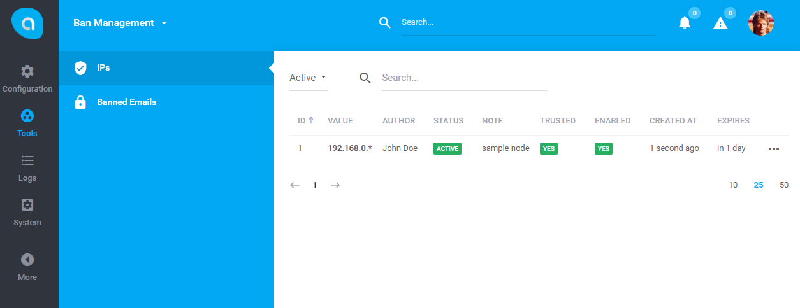

# Antares Ban Management Module

Ban Management Module improves application security, using advanced ip and emails blocking with wildcards and whitelists.

## Documentation

Antares Ban Management Module documentation is not finished yet.

Full Antares documentation can be found at [docs.antaresproject.io/php-framework](http://www.docs.antaresproject.io/php-framework).

## Changelog

Antares Ban Management Module changelog can be found in release notes [docs.antaresproject.io/php-framework/getting-started/changelog#ban_management](http://www.docs.antaresproject.io/php-framework/getting-started/changelog#ban_management).

You can find full Antares changelog in Antares Documentation [docs.antaresproject.io/php-framework/getting-started/changelog](http://www.docs.antaresproject.io/php-framework/getting-started/changelog).

## Issues

The issue list of this repo is **exclusively** for bug reports and feature requests.

Please follow [Issue Reporting Guide](http://www.docs.antaresproject.io/php-framework/getting-started/issues-reporting-guide) before opening an issue. Issues not following the guide will be closed without further investigation.

## Contribution

Please follow [Contribution Guide](http://www.docs.antaresproject.io/php-framework/getting-started/contribution-guide) before making a pull request.

## Community

* Twitter: @antaresproject
* Forum: (coming soon)
* Blog: (coming soon)
* Email: contact (at) antaresproject.io

## License

This software is released under the BSD 3-Clause License.

© 2017 INBS.Software.
